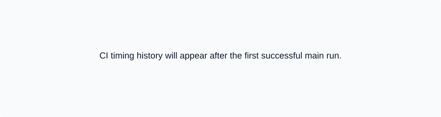
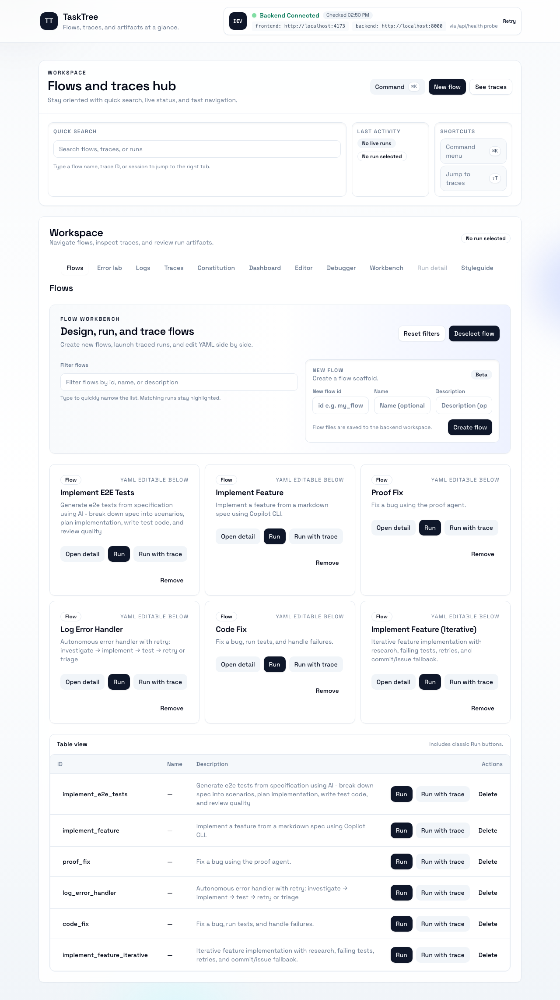

# TaskTree

TaskTree is a scaffold for running simple, traceable task DAGs with agents. This repo includes:
- A FastAPI backend with a flow executor, tracing, and a stub copilot agent.
- A React + Vite frontend for browsing flows and traces.
- Make targets plus CI wiring for uv + Node, aligned with local tooling (same commands locally and in CI).

<!--status:start-->
| Check | Status |
| --- | --- |
| CI |  |
| Pages |  |
| CodeQL |  |
| Security |  |
<!--status:end-->

## CI timing history
Latest CI runtime splits (auto-updated on successful pushes to `main`):



Raw history lives in `metrics/ci_timings.jsonl` and includes per-job/step durations for each run.

## Getting started
```
make setup
make dev
```
Backend runs on port 8000; frontend on 5173 with `/api` proxied to backend.
Quick make targets:

| Scenario | Backend | Frontend | Tools/notes | All-in-one |
| --- | --- | --- | --- | --- |
| Fresh setup (full) | `make setup-backend` | `make setup-frontend` | `make setup-tools` (shfmt/shellcheck) | `make setup` |
| Fresh setup (skip tools) | `make setup-backend` | `make setup-frontend` | — | `make setup-fast` |
| Format | `make format-backend` | `make format-frontend` | — | `make format` |
| Lint | `make lint-backend` | `make lint-frontend` | `make lint-shfmt` / `make lint-shellcheck` | `make lint` |
| Test | `make test-backend` | `make test-frontend` | — | `make test` |
| Coverage | `make coverage-backend` | `make coverage-frontend` | — | `make coverage` |
| Build | `make build-backend` | `make build-frontend` | — | `make build` |
| Dev servers | `make dev-backend` | `make dev-frontend` | — | `make dev` (both) |
| Scripts checks | — | — | `make verify-scripts` (shellcheck for scripts) | — |

Notes: `make lint-backend` runs Ruff with `--fix` before mypy/bandit/yamllint. `make test` runs backend pytest plus frontend Vitest **and** Playwright e2e (required for every change). `make ci` runs lint + test + build. `make setup-tools` installs shfmt/shellcheck into `.bin/` (PATH). For e2e-only reruns: `make test-e2e` (frontend Playwright).

### Dev servers and health
- Backend: `make dev-backend` (FastAPI on :8000 with reload).
- Frontend: `make dev-frontend` (Vite on :5173, proxies `/api` to :8000).
- Health: the UI header shows backend health via `DevServerStatus` (green when `/api/health` succeeds, red when offline). Logs stream in each dev server terminal.

### Prompt skeleton helper
- API: `GET /api/prompts/skeleton?action=<action>&agent=codex_cli` returns a JSON skeleton with the input keys referenced by the action’s prompt template (values empty). Useful for showing users what fields to fill.
- Example: `/api/prompts/skeleton?action=implement_feature&agent=codex_cli` yields `{"input":{"feature_spec":"","history":""}}`.

### Log-triggered agent (local)
- Watch a log and kick off a flow when an error appears:
  - `uv run tasktree.log_trigger --paths logs/backend-dev.log --patterns "ERROR" "Exception" --flow-id log_error_handler`
  - Add `--dry-run` to observe without running the flow; `--min-interval 30` rate-limits per file.
- Flow config: `backend/tasktree/config/flows/log_error_handler.yaml` (codex_cli investigate/implement/test stub with retry/triage).
- Details: `docs/LOG_TRIGGER.md`.

### Switching agent profiles (mock vs real LLM)
- Default agent config (`backend/tasktree/config/agents/codex_cli.yaml`) is mock-friendly for offline/dev.
- Set an env var before starting the API or running flows to swap to another config file in `backend/tasktree/config/agents/` (e.g., real Codex CLI):
  - All agents: `TASKTREE_AGENT_PROFILE=codex_cli_codex`
  - Per agent: `TASKTREE_AGENT_PROFILE_CODEX_CLI=codex_cli_codex`
- The value should match the YAML filename (without extension); a missing file will raise loudly on run start.

### Developer workflow (TTD-first)
- Favor a **TTD loop**: write or update a failing test/trace, make the smallest change, re-run `make lint test`, update docs, commit.
- Always run `make test` before considering a task done; it runs backend pytest plus frontend Vitest and Playwright e2e. No skipping e2e—even for docs/typos.
- Use `make format` to apply Ruff/Prettier before committing.
- Capture flow runs with the trace wrapper to keep artifacts reproducible.
- For commits, install hooks (`bash scripts/git_hooks/install_hooks.sh`) and use `scripts/runner.sh "<message>"` (serializes commits with .git/context-runner.lock, rebases on origin/<branch>, runs `make ci`, then pushes).

### Feature conveyor (Beads-first)
- Generate an epic + tasks from a spec: `./scripts/feature_to_beads.py --title "<feature>" --description-file spec.md --apply` (defaults to Discovery/Design/Implementation/Testing/Docs tasks; uses templates under `docs/templates/`).
- Every task keeps the **Retry Log (min 3 attempts on failure)**; log each failed attempt (date/change/tests) before escalating.
- Close tasks only after the listed validation commands pass (always include `make test`). Capture traces when flows are executed. See `docs/feature-conveyor.md` for the full recipe.

## Dogfooding examples
- Scenario Debugger / Variant Runner (spec in `docs/scenario-debugger-spec.md`), run via `implement_feature`:
  - `./tt run implement_feature --input '{"feature_spec": "<spec text>"}'`
  - Labels: `planned` → `implemented` → `verified`.
- Log Digest Helper (log triage dogfooding):
  - Buckets recent `ERROR`/`ERR`/`FATAL` lines by normalized signature, prints top N with exemplars, optionally writes a Prometheus textfile, and can run on a cron wrapper.
  - Scripts: `scripts/log_top_errors.py` (core), `scripts/run_log_digest.sh` (wrapper), output `logs/error_digest.log`.
  - Webhook/API: POST the structured JSON to `http://localhost:8000/api/log-digest/` (`GET /api/log-digest/` for latest, `/api/log-digest/history` for history, `/api/log-digest/view` for a minimal HTML view). Set `WEBHOOK_URL=http://localhost:8000/api/log-digest/ WEBHOOK_FORMAT=json` when running the helper.
  - Optional flow trigger: set `TASKTREE_LOG_DIGEST_FLOW_ID=log_error_handler` (or another flow id) in the backend env to automatically kick off a flow when a digest arrives.
- Flow graph rendering fix (log in `docs/flow-graph-rendering-dogfooding.md`), traced through `code_fix`:
  - `cd backend && uv run -m tasktree.agents.trace.record uv run tt run code_fix --input '{"bug_description": "Flow graph not rendering nodes in UI"}'`
  - Outcome: switched FlowGraph to `nodes`/`edges` props and added React Flow CSS; e2e and unit tests updated.
- Add more dogfooding runs here as they happen (brief spec pointer + flow command + notable labels).

## CLI
You can use the `./tt` wrapper from the project root:
```bash
./tt flows
./tt watch
./tt run code_fix --input '{"bug_description": "example"}'
```

Or within `backend/` you can run flows directly:
```bash
uv run tt flows
uv run tt run code_fix --input '{"bug_description": "example"}'
uv run tt run log_error_handler --input '{"error_log": "example error"}'
```

See `docs/tasktree-cli-usage.md` for a complete walkthrough (tested in CI), `AGENTS.md` for agent guidelines, and `backend/tasktree/config` for flows, prompts, and constitution.

## Docs & diagrams
- Keep high-level docs in `README.md` and detailed agent/process notes in `docs/`.
- Use Mermaid for diagrams where possible; keep source `.md/.mmd` files in `docs/mermaid/` (create as needed). See `docs/DIAGRAMS.md` for the render loop.
- Current diagram source: `docs/mermaid/flow-overview.mmd` (render to SVG/PNG via mermaid-cli).
- When behavior changes, update README and relevant docs in the same PR/commit to stay in sync.
- Scripts: `make test-scripts` runs shellcheck for our shell helpers. `shfmt` is optional—install if you want POSIX shell formatting checks. `make setup-tools` installs shfmt, shellcheck, and ripgrep into `.bin/`.
- Log sources config: `logs/log_sources.yaml` lists all globs searched by `log_search.sh`/alerts; defaults include repo logs, traces, and `~/.copilot/**/logs/**`; add entries for VS Code, Copilot CLI, Codex CLI, npm logs, etc.
- Log discovery/overview: `scripts/discover_logs.sh` suggests globs to add; `scripts/log_sources_overview.sh` summarizes counts/mtimes for configured sources.

## Shadcn/Tailwind UI
- Stack: Tailwind + Shadcn (Radix-based) lives in `frontend/`. Theme tokens are defined in `frontend/src/index.css`; Shadcn CLI config is in `frontend/components.json`.
- Add components: `cd frontend && npx shadcn-ui@latest add button input tooltip` (uses aliases `@/components` and `@/lib/utils`). Edit generated components freely—treat them as source.
- Styling conventions: prefer shared tokens (`--background`, `--primary`, `--radius`) over ad-hoc colors; use utility merges via `cn` from `@/lib/utils`.
- Testing: run `npm run test` (Vitest) and `npm run e2e` (Playwright) after UI changes; Peekaboo captures live under `frontend/tests/e2e/peekaboo-*.spec.ts`.
- Docs: see `docs/FE_SHADCN_CONTEXT.md` for design tokens/brand inputs and `docs/FE_SHADCN_GUIDE.md` for quick start + recipes.
- Theme toggles: press `Cmd/Ctrl + J` to toggle dark mode in the app (uses the `.dark` theme variables in `frontend/src/index.css`).
- Screenshots: latest UI previews live in `frontend/docs/images` (captured via `pnpm --dir frontend exec playwright test tests/e2e/screenshot.spec.ts --workers=1`).
  - Workspace hero (light): 
  - Flows view (light): 
  - Workspace hero (dark): 
  - Flows view (dark): 

## Lightweight archives
- Use `make zip` (wraps `scripts/zip_repo.sh`) to produce a code-only archive that respects `.gitignore`. Defaults exclude heavy assets (node_modules, logs, caches); see `docs/repo-compression.md` for flags and the full inclusion/exclusion policy.

## GitHub Pages & previews
- Marketing site lives in `site/` (bold gradient hero, stat cards, CTA) and publishes with the frontend build to GitHub Pages via `.github/workflows/pages.yml`.
- PRs touching `site/` or `frontend/` get a Pages preview comment with the preview URL; main publishes to the Pages environment.
- The app build is available under `/app/` on Pages; the marketing site is served at the root.

## ChatOps
- Slash commands on PRs: `/test backend|frontend|docs|all` triggers targeted runs via `manual-tests.yml`.
- Handy combos: `/test backend` before merging API changes, `/test frontend` after UI tweaks, `/test docs` for docs-only PRs to keep CI light, `/test all` before release tags.

## Releases
- Tag `v*.*.*` to run `release.yml`: builds backend wheel, frontend bundle, publishes GHCR image (keyless cosign + provenance), and uploads artifacts to the GitHub release.

## Tooling parity
- Python: `make lint-backend` runs `ruff check --fix`, `mypy`, `bandit`, `yamllint`, `djlint`; `make test-backend` runs pytest with coverage.
- Frontend: `npm run lint`, `npm run typecheck`, `npm run format:check`; `npm run test` (Vitest unit), `npm run e2e` (Playwright); `npm run coverage` for unit coverage.
- CI runs the same commands split across backend/frontend/docs-shell jobs.

## E2E (Playwright)
- Backend must be running on :8000 (e.g., `make dev-backend`).
- Run `npm run e2e` from `frontend/` (Playwright config auto-starts a dev server on :5173 if needed and reuses an existing one).
- First time, install browsers: `cd frontend && npx playwright install chromium`.

## VS Code tips
- Recommended extensions are in `.vscode/extensions.json` (Python, Pylance, Ruff, ESLint, Prettier, GitHub Copilot/Copilot Chat).
- Settings in `.vscode/settings.json` enable format-on-save with Ruff for Python and Prettier for TS/TSX; ESLint is scoped to `frontend/`.
- After installing GitHub Copilot, sign in and enable for this workspace; pair it with the TTD loop (have it draft tests before code changes).
- Copilot Chat is useful for "why is this failing?"; include failing test output when you ask; always validate suggestions with `make lint test` before committing.

## Git hooks
- Install provided hooks with `bash scripts/git_hooks/install_hooks.sh`.
- Pre-commit runs `make ci` (lint/tests/build); set `SKIP_CI_HOOK=1` to skip temporarily.
- Commit-msg enforces non-empty subject <=72 chars; `SKIP_COMMIT_MSG_HOOK=1` to skip.
